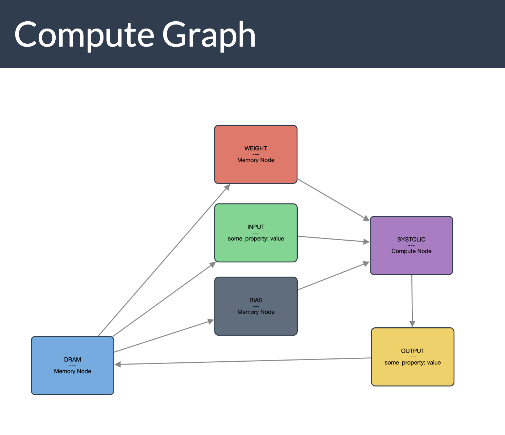
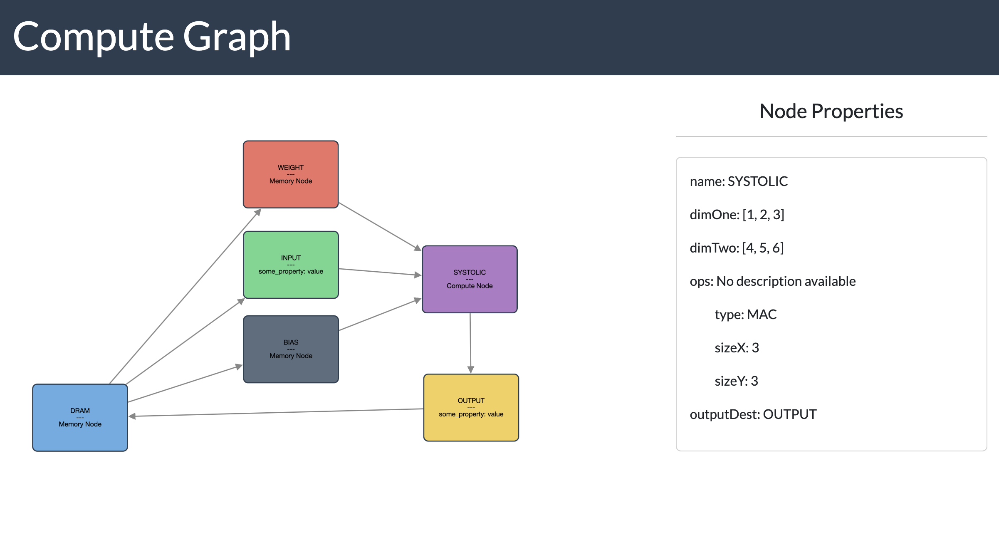
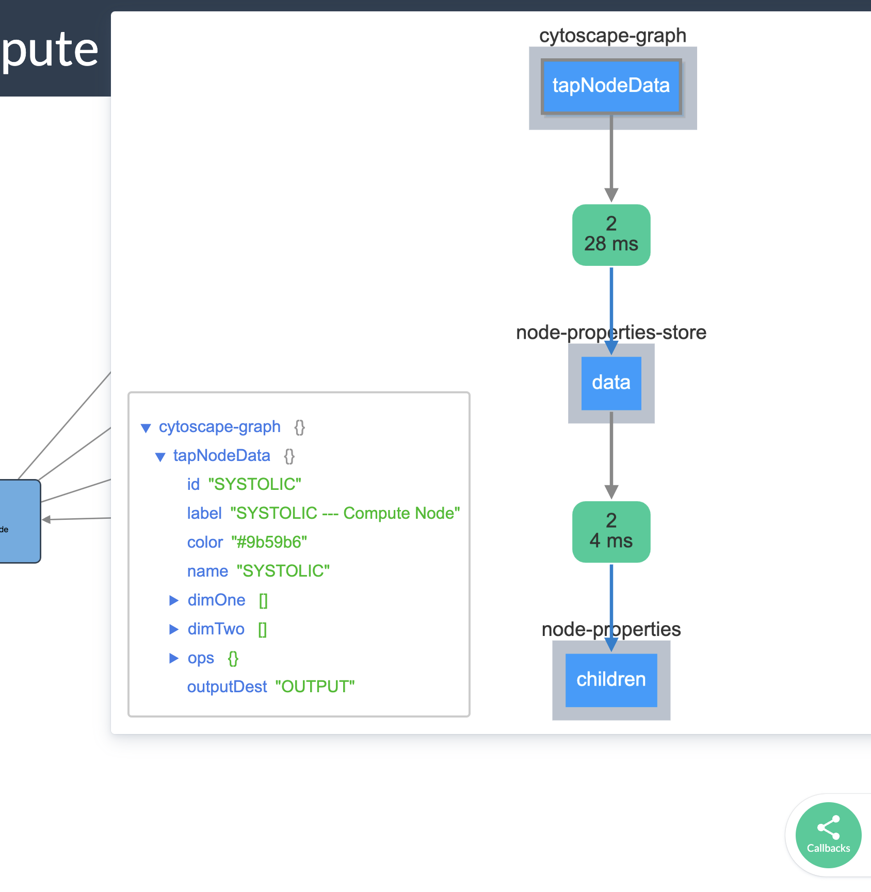

# Network Graph

### Description 
Data Structure: Graph using NetworkX library in Python and using dash with cytoscape for visualization.

### Packages Needed to Run the Code
```- NetworkX
- Dash
- Dash html components
- Dash dcc components
- Dash bootstrap components
- Dash cytoscape
```

### How to Run the Code
- Run the code in a python environment and open the link in the browser.
```
 python my_graph_tool.py
 ```


### Output





### Callback Functions Overview

- Callback function to update the node properties when a node is clicked.

